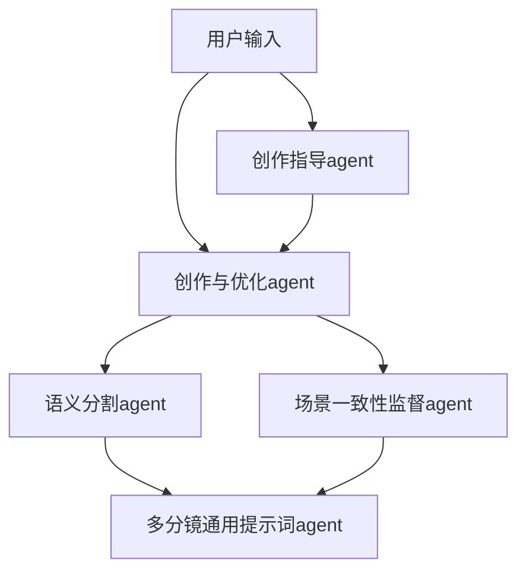

项目名称:用于多分镜长视频AI生成的创意提示词增强系统

功能:用户只需要输入百字级的视频创意文本由AI将创意落地生成全部的可用于AI生成视频软件的多分镜提示词集，供下游使用；
    或者用户输入完整的无需扩充的文本，由AI完成长文本的语义分割和多分镜提示词生成，增强对应文本的AI生成视频效果。

架构:该项目为多agent-skillTools协作架构，程序协同通过建构工作流实现主要功能;

agent构建:LLM调用(使用中转api调用，需要撰写中转api的代理)+任务定义提示词+skillTool；
注:任务定义提示词文件格式:角色+任务描述+任务技巧+输入描述+输出描述+输出格式(可选)

项目工作流:

各个agent的任务表述:
1. 创作指导agent:思考对于用户的创意使用哪些创作方式和创作技巧可以创作出好的作品
2. 创作与优化agent:两个功能
    1. 按照创作指导创作
    2. 按照创作指导检查哪里写的不好，重新修正
3. 语义分割agent:对于创作文本进行有利于AI视频生成的短场景语义分割，必须够短，符合现有AI生成视频一般时长的语义文本（4-6s视频时长对应的文本）
4. 场景一致性监督agent:搜索文本中需要保持一致性较高的事物，不能在不同分镜里表现不同，只能是与周围环境的显示角度，位置发生合理改变，主体本身保持较高一致性
5. 多分镜通用提示词agent:对于多个分镜的文本进行详细描述细节，但不能违背场景一致性监督指导的事物，输出用于AI视频生成模型输入

该项目使用python实现